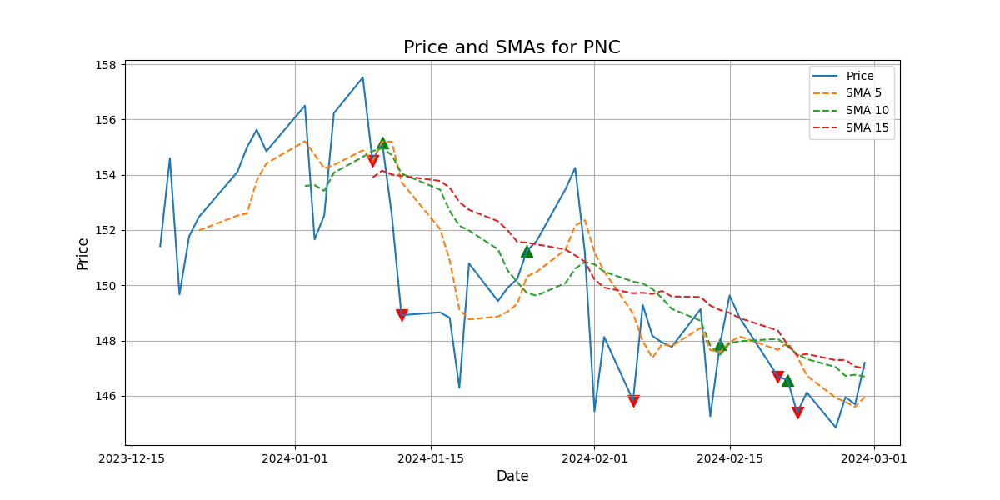

# StockTuna Documentation

[Previous Page: StockTuna.sma()](./sma.md)

#### StockTuna.sma_graph( bars, periods, symbol )

This void method calculates the Simple Moving Average (SMA), and creates a MatPlotLib graph of all SMAs over the closing prices for the specified range, and buy/sell signals in `./charts/`. The method takes three arguments:

- `bars` - a list of bar objects from Alpaca
- `periods` - an arbitrarily large list of integers to specify the SMAs to write to the PNG file.
- `symbol` - a string representing the stock symbol. This is only used for naming the PNG file and writing on the image.

The SMA is computed by the same workflow as `StockTuna.sma()` and with the same input parameters, should have the same output. Buy signals are generated when a shorter SMA moves above a longer SMA, while a sell signal is generated when a longer SMA goes above a shorter SMA. The filename is generated as ```charts/sma_{period_str_1}_{period_str_2}_..._{symbol}_chart.png```

Here's an example of its use:

```commandline
from stocktuna.stocktuna import PaperTuna
from alpaca_trade_api.rest import TimeFrame
from datetime import datetime, timedelta

# config
timeframe = TimeFrame.Day
investment_time = 365
start_date = (datetime.now() - timedelta(days=investment_time)).strftime('%Y-%m-%d')

# create PaperTuna object
tuna = PaperTuna(1)

#  create list of SMA periods
periods = [ 5, 10, 15 ]

# get bars to graph over SMAs
bars = tuna.stocktuna.api.get_bars("PNC", timeframe, start=start_date, limit=50)

# create graph
tuna.stocktuna.sma_graph( bars, periods, "PNC")
```

The output PNG file would then look like:




[Next Page: StockTuna.ema()](./ema.md)